Projekt martyszewicz_app zawiera 3 aplikacje:
- Coffee machine - prosta symulacja komercyjnego oprogramowania do ekspresu do kawy
- Movies collections - aplikacja oferująca budowanie i zarządzanie biblioteką ulubionych filmów
- Tic tac toe - gra w kółko i krzyżyk oferująca możliwość gry z komputerem lub innym użytkownikiem

1. Coffee machine:
Ekspres oferuje 3 rodzaje kawy do zrobienia. Każda kawa ma swoją cenę i należy wrzucić do ekspresu wymaganą kwotę. Ekspres wydaje resztę i zbiera dane z przeprowadzonych transakcji.
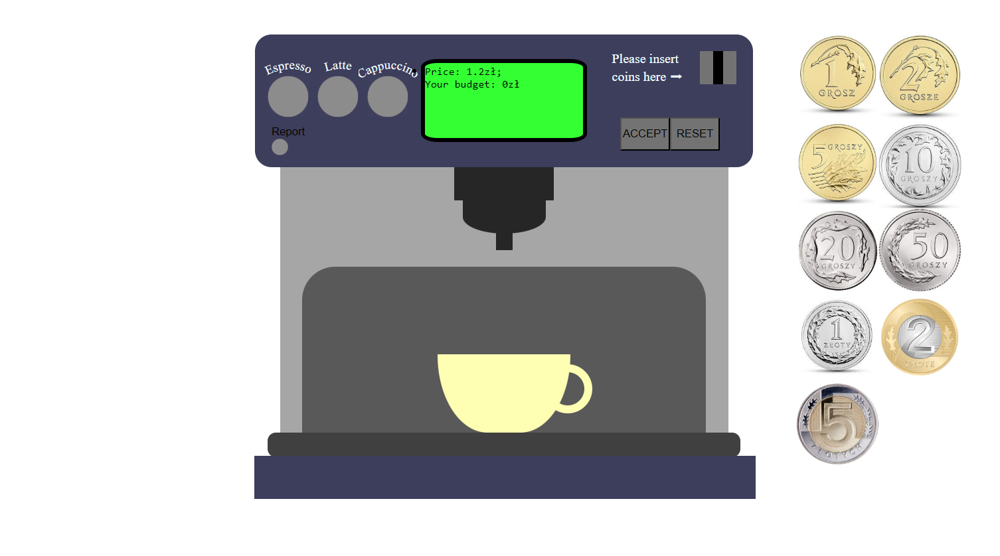
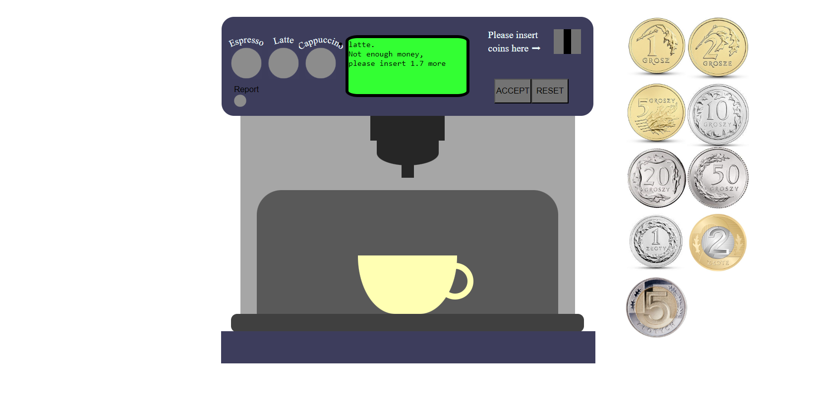
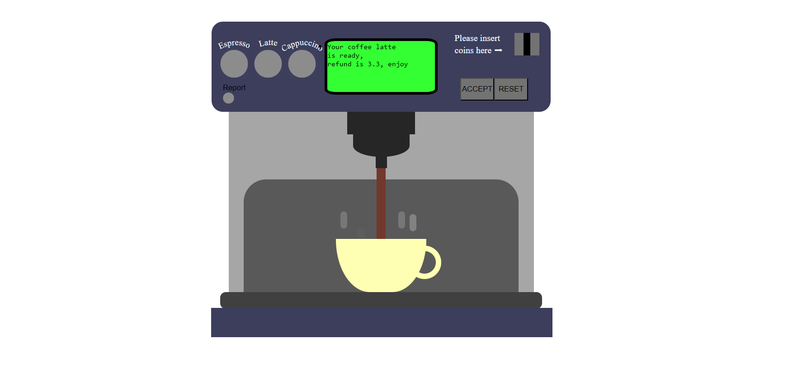

3. Movies collections:
Aplikacja oferuje wyszukiwanie filmów z biblioteki IMDb oraz po utworzeniu konta zapisanie ulubionych filmów na swoim koncie. Administrator posiada możliwość zarządzania użytkownikami.
W aplikacji istnieje możliwość wyboru języka.
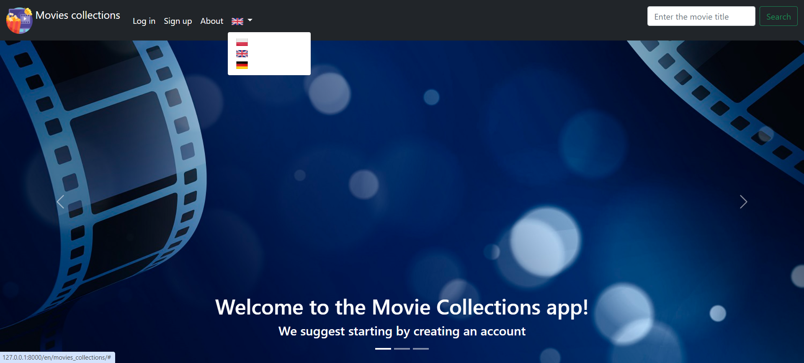
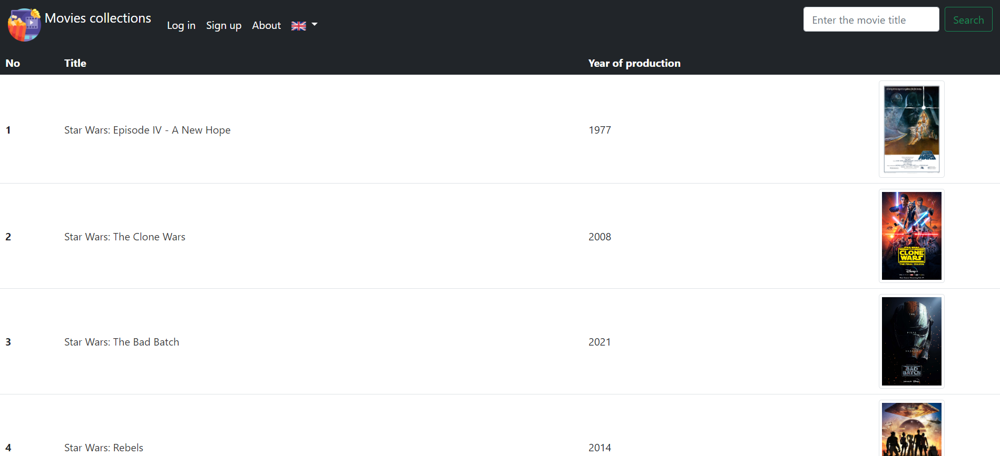
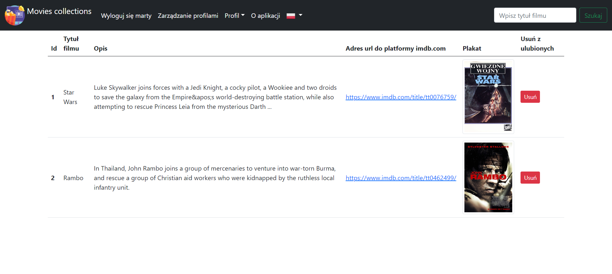
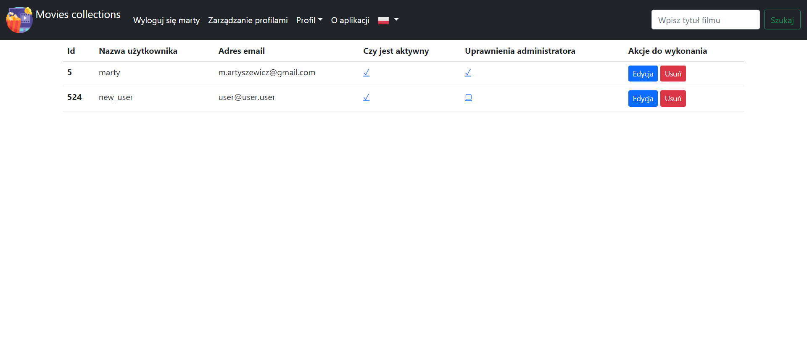

5. Tic tak toe:
Gra w kółko i krzyżyk, oferuje możliwość gry z komputerem oraz z innym graczem. Po utworzeniu pokoju, zabezpieczonego hasłem lub nie istnieje możliwość gry z innym graczem. W pokoju gry dostępny jest czat między graczami.
Do tego aplikacja oferuje możliwość wyboru języka.
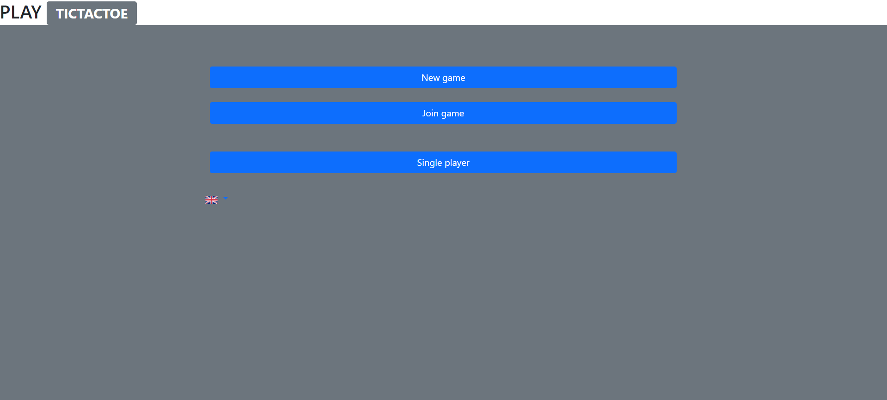
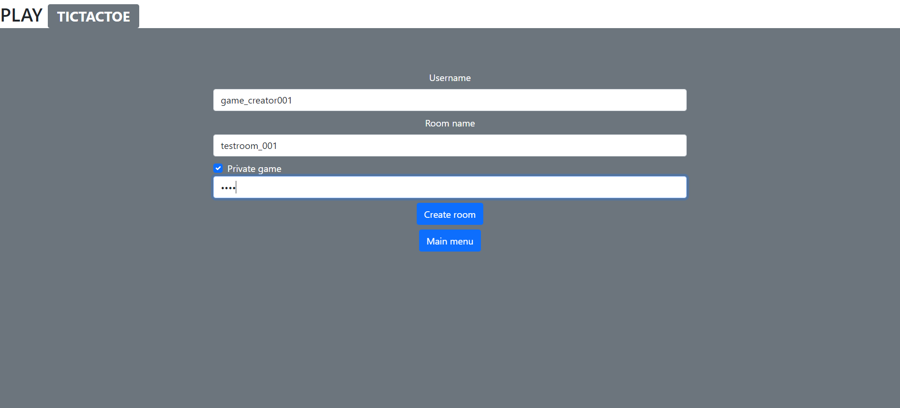
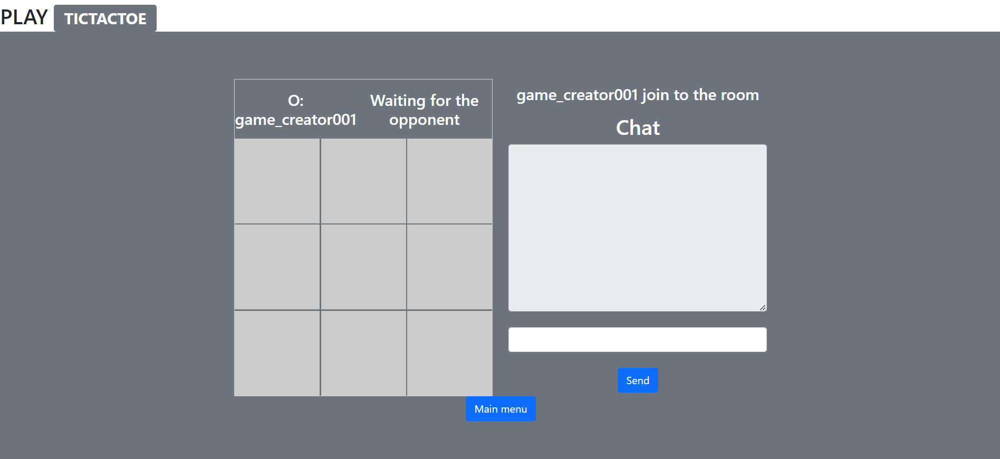
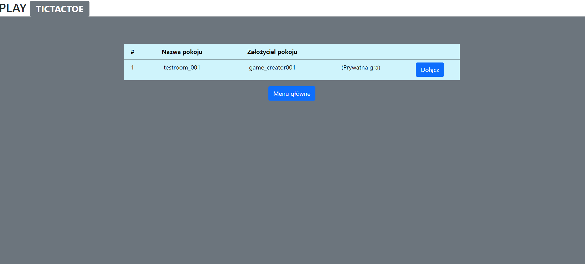
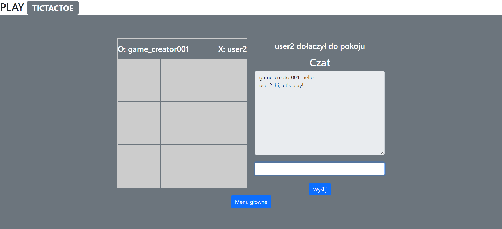
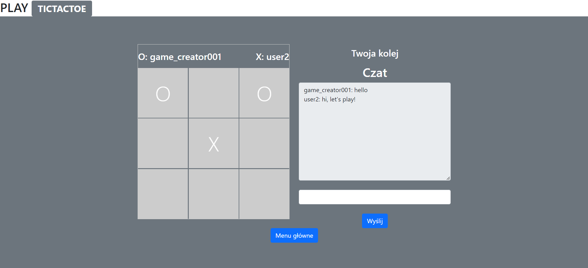

Wymagania:
Aby uruchomić aplikacje należy zainstalować wymagania z pliku requirements.txt
W celu uruchomienia gry dla dwóch osób niezbędne jest uruchomienia serwera redis.
