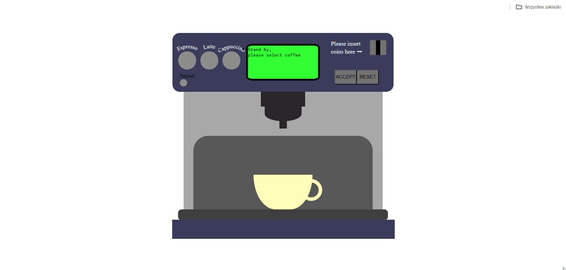
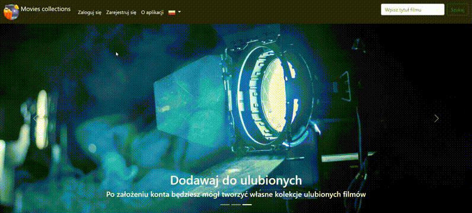
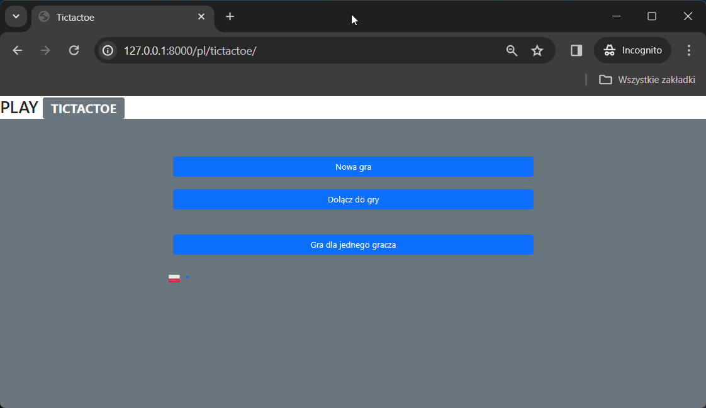
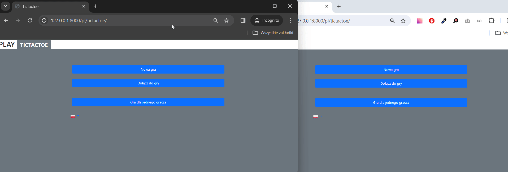

EN:
  The martyszewicz_app project consists of 3 applications:
  - Coffee machine - a simple simulation of commercial coffee machine software
  - Movies collections - an application for building and managing a library of favorite movies
  - Tic tac toe - a tic-tac-toe game offering the option to play against a computer or another user

PL:
  Projekt martyszewicz_app zawiera 3 aplikacje:
  - Coffee machine - prosta symulacja komercyjnego oprogramowania do ekspresu do kawy
  - Movies collections - aplikacja oferująca budowanie i zarządzanie biblioteką ulubionych filmów
  - Tic tac toe - gra w kółko i krzyżyk oferująca możliwość gry z komputerem lub innym użytkownikiem

EN:
  1. Coffee machine:
  The machine offers 3 types of coffee to make. Each coffee has its price, and the required amount must be inserted into the machine. The machine dispenses change and collects data from transactions.

PL:
  1. Coffee machine:
  Ekspres oferuje 3 rodzaje kawy do zrobienia. Każda kawa ma swoją cenę i należy wrzucić do ekspresu wymaganą kwotę. Ekspres wydaje resztę i zbiera dane z przeprowadzonych transakcji.

  

EN:

  2. Movies collections:
  The application allows searching for movies from the IMDb library and, after creating an account, saving favorite movies to one's account. The administrator has the ability to manage users.
  The application also offers language selection.
  
PL:

  2. Movies collections:
  Aplikacja oferuje wyszukiwanie filmów z biblioteki IMDb oraz po utworzeniu konta zapisanie ulubionych filmów na swoim koncie. Administrator posiada możliwość zarządzania użytkownikami.
  W aplikacji istnieje możliwość wyboru języka.
  

EN:

  3. Tic tac toe:
  A tic-tac-toe game offering the option to play against a computer or another player. After creating a room, protected by a password or not, players can play against each other. In the game room, there is a chat   available between players.
  Additionally, the application offers language selection.
  
PL:

  3. Tic tak toe:
  Gra w kółko i krzyżyk, oferuje możliwość gry z komputerem oraz z innym graczem. 
  Po utworzeniu pokoju, zabezpieczonego hasłem lub nie istnieje możliwość gry z innym graczem. W pokoju gry dostępny jest czat między graczami.
  Do tego aplikacja oferuje możliwość wyboru języka.

  Single player / Tryb dla jednego gracza:
  
  

  Multi player / Tryb dla dwóch graczy:
  
  

EN:

  Requirements:
  To run the applications, you need to install the requirements from the requirements.txt file.
  To run the game for two people, it is necessary to run a Redis server.

PL:

  Wymagania:
  Aby uruchomić aplikacje należy zainstalować wymagania z pliku requirements.txt.
  W celu uruchomienia gry dla dwóch osób niezbędne jest uruchomienia serwera redis.
